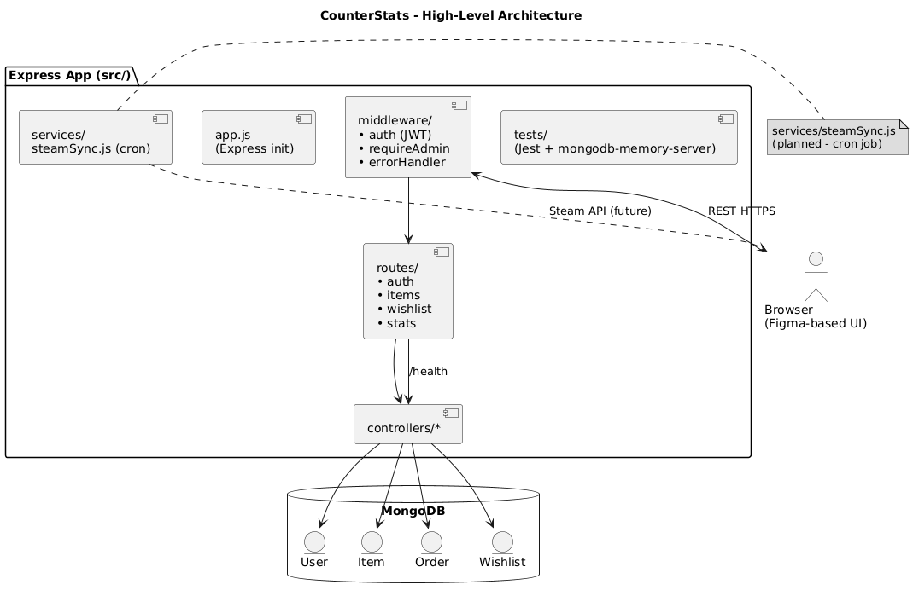

# CounterStats

A web application for managing and tracking weapon skins from Steam games, providing advanced statistics, wishlist functionality, and automatic synchronization with the Steam API.

---

## 📦 Project Structure

conterstats/
├─ src/
│ ├─ app.js / server.js
│ ├─ controllers/ (auth, items,wishlist, stats)
│ ├─ routes/ (/auth, /items, /wishlist, /stats)
│ ├─ models/ (User, Item, Order, Wishlist)
│ ├─ middleware/ (requireAuth, requireAdmin, notFound, errorHandler)
│ └─ services/ (steamSync.js with cron + TTL-On-Demand)
├─ tests/
├─ seeds/
├─ public/
├─ docs/
├─ .env.example
└─ README.md

---

## 🚀 Running the Project

### Prerequisites

- Node.js 18+
- MongoDB

### Install Dependencies

```bash
npm install
```

# Environment Variables

Create an .env file based on the .env.example template:

env
JWT_SECRET="your_jwt_secret"
MONGO_URI="your_mongodb_uri"
PORT=3000
STEAM_API_KEY="your_steam_api_key"
SYNC_CRON_SCHEDULE="5 _/6 _ \* \*"
SYNC_TTL_MINUTES=15

# Seed Database (initial data)

npm run seed:all

# Run Development Server

npm run dev

# API Cheatsheet

Method Endpoint Description
POST /api/auth/login User login (JWT)
GET /api/items Retrieve all items
GET /api/items/:id Retrieve specific item details
POST /api/wishlist Add an item to user's wishlist
GET /api/wishlist Retrieve user's wishlist
DELETE /api/wishlist/:id Remove item from user's wishlist
GET /api/stats/top-items?limit=N Get top N items
GET /api/stats/me/summary Get authenticated user's stats summary
GET /api/stats/users/:id/summary Get specific user's stats summary

# Testing

Run automated tests (Jest + Supertest):
npm test

# UML Diagrams

All UML diagrams can be found in the docs/ folder in PNG format.

### 📊 Architecture Overview



### Future Tasks

Frontend development according to Figma design

JWT Token management in LocalStorage

Frontend and Backend deployment

Performance optimization and code cleanup

📝 Authors
This project was created by Amit Sacks and Eyal darab as part of a final project in Web and Cloud Engineering.
